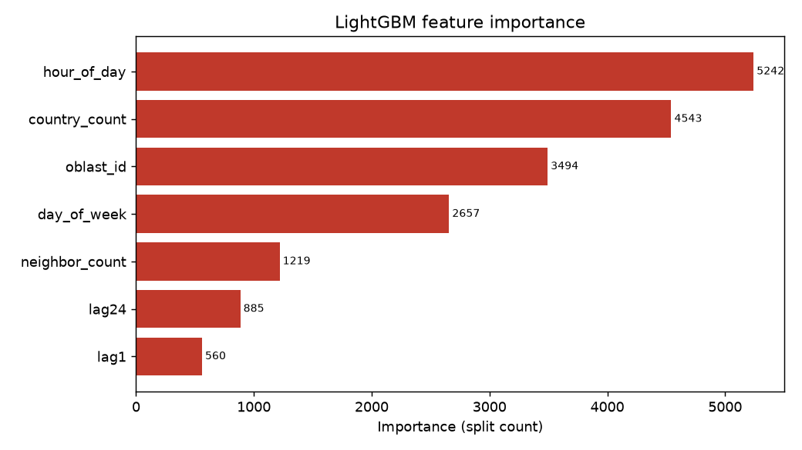
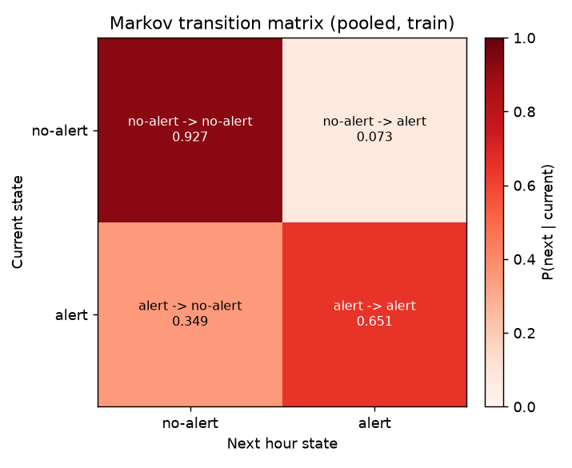

# Advanced Air Raid Calendar

An educational, AI-assisted pet-project built in two days for the **KSE AI Agentic Summer School**. It estimates the probability that an air-raid alert is active in each Ukrainian oblast, and compares three different modelling approaches against the same historical data.

There are two distinct things in this repo:

1. **A Streamlit map app** — pick a window of hours (Kyiv time) and see, per oblast, the historical chance of an alert being active during that window. This is driven by a simple frequency baseline.
2. **A three-model comparison** — a frequency baseline, a Markov chain, and a LightGBM classifier, all evaluated on the same temporal train/test split with the same metrics (Brier score and PR-AUC).

The map shows the baseline only. The Markov and LightGBM models are a separate *next-hour prediction* track, evaluated offline — they do not feed the map.

## How to run

```bash
# Install dependencies (Python 3.11+)
pip install -r requirements.txt

# Build the artifacts
python build_model.py        # frequency baseline
python build_markov.py       # Markov chain
python build_lgbm.py         # LightGBM
python compare_models.py     # Brier + PR-AUC table

# Launch the app
streamlit run app.py
```

The app reads only the pre-built `model/` and `data/` files — it never recomputes from the raw CSV at request time, so it stays responsive. Run the build scripts once before the first launch; re-run them only if you change the data or the split.

## Data source and the snapshot decision

The data comes from the [Vadimkin/ukrainian-air-raid-sirens-dataset](https://github.com/Vadimkin/ukrainian-air-raid-sirens-dataset) (`official_data_en.csv`): one row per alert, with a start and end timestamp per region. All source timestamps are UTC; we convert them to a fixed **UTC+3** offset for hour-of-day bucketing.

> **Timezone caveat.** Real Kyiv time follows DST (UTC+2 in winter, UTC+3 in summer). This is an MVP with no location or DST tracking, so we deliberately pin a single fixed offset (UTC+3) rather than use the real `Europe/Kyiv` zone.

The repo uses a **static snapshot** committed to `data/alerts_snapshot.csv`, not a live feed. This is intentional: it makes every result in this README exactly reproducible. There is no scraping, no API polling, no daily refresh. The snapshot covers **2022-03-15 to 2026-06-23**.

The map boundaries come from a separate admin-1 (oblast) GeoJSON. Oblast names in the alert data and in the GeoJSON do not match out of the box, so there is one explicit name-mapping table (`GEOJSON_TO_CSV` in `app.py`). Crimea has no alert data and renders in grey as "No data".

## The three models, and why three

The point of the project is the *comparison*, not any single model. "Time-series analysis" only means something if you have a baseline to beat and a way to measure beating it.

1. **Frequency baseline.** For each `(oblast, hour-of-day)` it stores the fraction of historical time an alert was active. No sequence, no memory — just "how often, at this hour, historically." This is the reference the other two must beat, and the only model the map uses.
2. **Markov chain.** Two states per oblast (alert / no-alert), a 2×2 transition matrix estimated from the training period. It predicts the next hour from the current state only. This tests one hypothesis: *does knowing the immediately preceding hour help?*
3. **LightGBM classifier.** Binary "will an alert be active next hour," with engineered features: lag-1 and lag-24 state, hour-of-day, day-of-week, active-neighbour count, and country-wide active count. This tests whether richer context beats simple persistence.

All three are scored on the **same temporal split** (train before `2025-01-01`, test after) and the **same metrics**, so the numbers are directly comparable. Every feature at time *t* uses only data strictly before *t*; this guardrail is stated in the code and is the reason the scores are realistic rather than suspiciously perfect.

## Results

Test set: **323,400** (oblast × hour) pairs, all from `2025-01-01` onward. Alert base rate ≈ **11.9%**.

| Model | Brier ↓ | PR-AUC ↑ |
|---|---|---|
| Frequency baseline | 0.09573 | 0.31521 |
| Markov chain | 0.05337 | 0.70904 |
| **LightGBM** | **0.04798** | **0.78323** |

Brier: lower is better (0 = perfect, 0.25 = random coin flip). PR-AUC: higher is better; a random classifier scores roughly the base rate (~0.12), so all three clear that bar comfortably.

**One-line finding: persistence dominates.** The single biggest jump is baseline → Markov — just knowing whether an alert was active *last hour* more than doubles PR-AUC (0.32 → 0.71). LightGBM's extra features add a further, smaller gain (0.71 → 0.78). Alerts are sticky in time; most of the predictive signal is "it was on a moment ago, it probably still is."

Why report PR-AUC alongside Brier? With a ~12% base rate, alerts are the rare class. Brier is dominated by the many easy no-alert hours, so it compresses the differences between models. PR-AUC focuses on the positive (alert) class and separates the models far more clearly — note how close the Brier values look versus how far apart the PR-AUC values are.

## Report artifacts

These two plots are produced by the build scripts into `reports/` for analysis. They are **not** shown in the app.

### LightGBM feature importance



**Read this with care: the bars are split counts, not predictive contribution.** LightGBM's default importance counts how many times each feature was used to split a tree. Continuous, high-cardinality features (`hour_of_day`, the count features, `oblast_id`) naturally offer many distinct split points and rack up high counts. The binary lag features (`lag1`, `lag24`) can only split one way and so score *low on this chart* — even though the results table shows that last-hour persistence carries most of the real signal. In other words: a low split-count bar does **not** mean a weak feature here. This artifact is a diagnostic of model structure, not a ranking of importance; for the actual "what matters" answer, trust the ablation visible in the comparison table.

### Markov transition matrix



The 2×2 transition matrix, pooled across all oblasts from the training period (each row sums to 1). The diagonal is heavy: `no-alert → no-alert` and `alert → alert` both dominate, which is exactly the stickiness that makes persistence such a strong predictor. The off-diagonal cells (`no-alert → alert`, `alert → no-alert`) are the rare transitions the harder models try to anticipate.

## Limitations

- **Not a forecast.** Every output is a historical-frequency probability presented as a chance. It says "at this hour, historically, the odds looked like this" — it does not predict any specific future date.
- **Hour-of-day only (map).** The map's baseline conditions on hour-of-day and nothing else: no day-of-week, no seasonality, no trend over the war's phases.
- **Fixed timezone.** UTC+3 with no DST handling (see above) — winter hours are shifted one hour late, since a fixed +3 is applied year-round.
- **Occupancy ≠ onset.** The baseline measures the chance an alert is *active*, not the chance one *begins*. A long alert inflates many hour-buckets.
- **Coarse Markov state.** Two states per oblast, hourly resolution, one pooled-by-oblast structure. It cannot represent duration, intensity, or cross-oblast dynamics.
- **Snapshot, not live.** Results reflect one frozen download; they will not track current events.
- **No spatial model.** Oblasts are treated independently apart from LightGBM's neighbour-count feature; no real geographic propagation is modelled.

## How AI was used to build this

I built this project by directing a coding agent (Claude Code) instead of
writing the code by hand in order to show the kind of AI-collaboration the
KSE program is about. My role was to set the goals, make the modelling
decisions, and define the guardrails. The agent handled the implementation
and iteration.

The decisions that mattered were mine, not the agent's. The most important
one was a constraint, not code: every feature must use only data from strictly
before the hour being predicted, with the explicit rule that a near-perfect
score is a bug to hunt, not a success. I had the agent encode that guardrail
into each build script. The other call I made myself was refusing to read the
feature-importance chart at face value: the raw split-count bars are
misleading, and reconciling them against the comparison table is what turned a
generated plot into an actual finding.

AI accelerated the build dramatically and let me finish in   the time I had. The
judgement about what to measure, what to trust, and what to flag stayed with me.

You can find my conversations with AI in /SESSION_x. Also check the INSTRUCTION.md for the initial prompt to Claude Code.